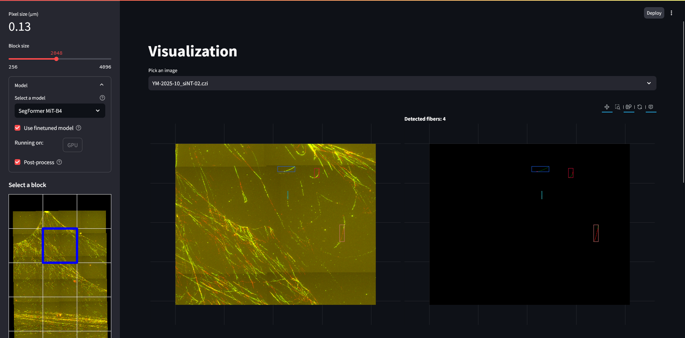

# DN-AI

This is the official repository for DN-AI, an automated tool for measurement of differentiated DNA replication in fluorescence microscopy images.

DN-AI offers different solutions for biologists to measure DNA replication in fluorescence microscopy images, without requiring any programming skills. See the [Installation](#installation) section for instructions on how to install DN-AI.

## Features

- **Automated DNA replication measurement**: DN-AI can automatically measure the amount of DNA replication in fluorescence microscopy images. We use a deep learning model to segment the images and measure the amount of DNA replication.
- **User-friendly interface**: DN-AI provides a web-based user-friendly interface that allows users to easily upload images and view the results. Both jpeg and tiff images are supported.
- **Batch processing**: DN-AI can process multiple images at once, making it easy to analyze large datasets. It also supports comparing ratios between different batches of images.


## Installation

DN-AI relies on Python. We recommend installing its latest version (3.10 or higher) and using a virtual environment to avoid conflicts with other packages.

### Prerequisites
Before installing DN-AI, make sure you have the following prerequisites installed:
- [Python 3.10 or higher](https://www.python.org/downloads/) 
- [pip](https://pip.pypa.io/en/stable/installation/) (Python package installer)
- [git](https://git-scm.com/downloads) (version control system)

### Graphical User Interface (GUI)
To install DN-AI with a graphical user interface, you can use the following command from a terminal or command prompt:

```bash
git clone https://github.com/ClementPla/DeepFiberQ/tree/main
```
Then, navigate to the `DeepFiberQ` directory and run the following command:

```bash
pip install .
```
This will install DN-AI along with all its dependencies. After installation, you can run the GUI by executing:

```bash
streamlit run ui/Welcome.py
```

Then open your web browser and go to `http://localhost:8501` to access the DN-AI interface.

Screenshots of the GUI:



### Python Package
To install DN-AI as a Python package, you can use pip:

```bash
pip install git+https://github.com/ClementPla/DeepFiberQ/tree/main
```


### Docker
A Docker image is available for DN-AI. You can pull the image from Docker Hub:

```bash
docker pull clementpla/dnafiber
```

### Google Colab
We also provide a Google Colab notebook for DN-AI. You can access it [here](https://colab.research.google.com/github/ClementPla/DeepFiberQ/blob/main/Colab/DNA_Fiber_Q.ipynb).

